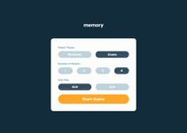

# Frontend Mentor - Memory game solution

This is a solution to the [Memory game challenge on Frontend Mentor](https://www.frontendmentor.io/challenges/memory-game-vse4WFPvM). Frontend Mentor challenges help you improve your coding skills by building realistic projects.

## Table of contents

- [Overview](#overview)
  - [The challenge](#the-challenge)
  - [Screenshot](#screenshot)
  - [Links](#links)
- [My process](#my-process)
  - [Built with](#built-with)

## Overview

### The challenge

Users should be able to:

- View the optimal layout for the game depending on their device's screen size
- See hover states for all interactive elements on the page
- Play the Memory game either solo or multiplayer (up to 4 players)
- Set the theme to use numbers or icons within the tiles
- Choose to play on either a 6x6 or 4x4 grid

### Screenshots

Click to open the full-size screenshot.

| Mobile layout                                                                                                         | Desktop layout                                                                                                          |
| --------------------------------------------------------------------------------------------------------------------- | ----------------------------------------------------------------------------------------------------------------------- |
|                          |                          |
|          |          |
|  |  |
|            |            |
|    |    |

### Links

- Solution URL: [Add solution URL here](https://your-solution-url.com)
- Live Site URL: [Add live site URL here](https://your-live-site-url.com)

## My process

### Built with

- Semantic HTML5 markup
- CSS custom properties
- Flexbox
- CSS Grid
- Mobile-first workflow
- [React](https://reactjs.org/) - JS library
- [Vite](https://vitejs.dev/) - Build tool
- [Tailwind](https://tailwindcss.com/) - CSS Framework
